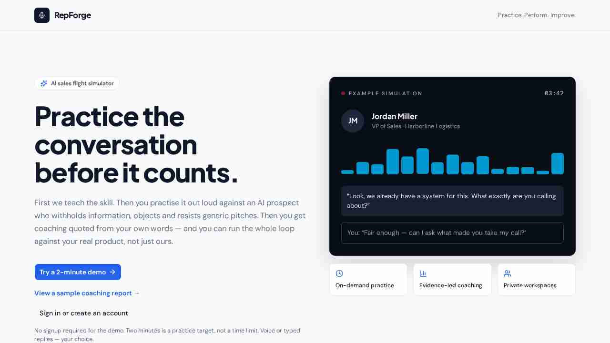
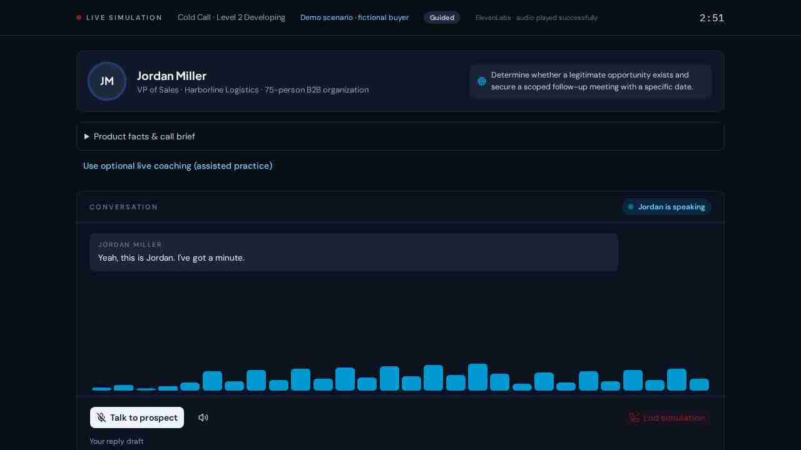
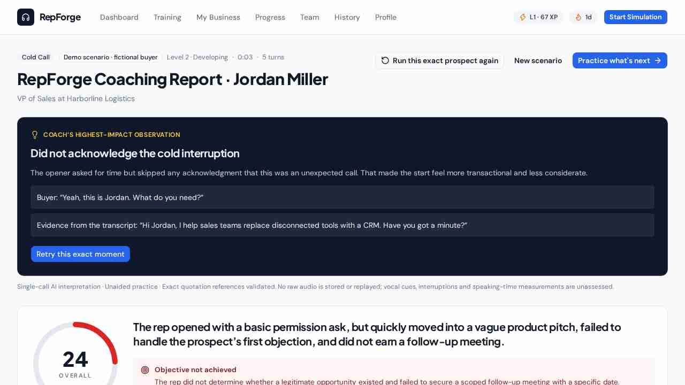

# RepForge

## Practice the conversation before it counts.

RepForge is an AI sales flight simulator for new and developing sales professionals.
Knowing sales theory is different from handling a real buyer. Manager-led role-play
requires another person's time; RepForge offers realistic repetitions and immediate,
conversation-specific coaching before a rep practises on customers.

**The loop:** choose a situation → review the brief → speak or type → receive
evidence-linked coaching → retry a specific moment → review separate practice history.

- **Live app:** [www.therepforge.app](https://www.therepforge.app/)
- **Updated build verified here:** [RepForge preview](https://prospect-practice.preview.emergentagent.com)
- **Release status:** [Project status](docs/PROJECT_STATUS.md) · [Validation](docs/VALIDATION.md)

This repository is the maintained source version. The Emergent deployment is separate;
pushing code here does not publish it to the live app. See [GitHub review](docs/GITHUB_REVIEW.md)
for the latest local checks and remaining release work.

### Implemented and checked

- Guided sales exercises, five buyer difficulty levels, recurring fictional buyers and
  Practice My Business remain part of the product; the demo is a preconfigured Level 2 cold call.
- Browser speech recognition, ElevenLabs prospect playback, microphone setup, explicit
  typed mode and durable transcript storage. Human microphone/audio quality is **not**
  established by automated tests.
- Frozen-transcript grading with a strict evidence rubric; exact quote/turn validation,
  applicable skill weights, recoverable provider failures and one bounded validation repair.
- Exact-moment coached drills and clearly labelled full-retry comparisons. Coached
  attempts do not masquerade as unaided improvement; a tie is not improvement.
- Isolated personal/guest workspaces, account-email-bound invitations, manager-only
  team reports/assignments, server-verified sessions and logout revocation.
- Emergent-managed Google sign-in alongside email/password and guest access. Existing
  accounts link only with verified provider email evidence or a one-time RepForge
  password confirmation; their records and workspace permissions remain unchanged.
- Persistent history, text-derived counts, explicit skill coverage and restricted owner
  usage evidence. No invented adoption, revenue or measured manager-time savings.

See the [validation matrix](docs/VALIDATION.md) for what was exercised live, mocked,
carried forward or left for manual verification. This is not a production-security certification.

### Actual application screenshots

Captured from the updated preview using a controlled internal demo and fictional buyer/product
data. These are browser screenshots, not AI-generated mockups or customer testimonials.


*Landing page; the buyer conversation illustration is explicitly an example.*


*Actual fictional demo call with a typed reply option and prospect playback; no personal customer data.*


*Actual AI-graded demo conversation, not a hand-authored performance claim.*

### How it was built

RepForge was built with Emergent and refined through product direction, code review,
iterative implementation and testing. Emergent supported the full-stack application,
provider integrations, persistence, UI and verification workflow. This README does not
claim the code was written entirely by hand or invent contributor/ownership details.

## Layout

```
repforge/
  backend/   FastAPI + motor (async MongoDB) + Pydantic v2 — Python
  frontend/  Vite + React 19 + Tailwind v4 + shadcn/ui (TypeScript strict)
  tests/     Playwright e2e workspace (pre-scaffolded)
  docs/      Demo, architecture, validation, project status and real screenshots
  scripts/   Read-only public-release audit and documentation checks
```

## Running locally

Use Python 3.12, Node 24 and a separate MongoDB database. Do not connect tests to
production. The reviewed installation used macOS with MongoDB 8.0.

```bash
python3 -m venv .venv
source .venv/bin/activate
python -m pip install -r backend/requirements-lock.txt
cp backend/.env.example backend/.env
cd frontend
npm ci
cd ..
```

Set `JWT_SECRET` in your private `backend/.env` to a random value generated with
`python -c "import secrets; print(secrets.token_urlsafe(48))"`. Do not commit it.
Set `MONGO_URL` and `DB_NAME` for your local database.

For real AI practice, set `OPENAI_API_KEY`; the standard OpenAI SDK runs independently
of Emergent. `OPENAI_MODEL` defaults to the existing `gpt-5.4` selection. Set
`ELEVENLABS_API_KEY` for prospect audio. Missing providers produce an error; they do not
silently substitute fictional results. No provider keys belong in frontend files.

To use an Emergent universal key instead, install `backend/requirements-emergent.txt`
using the package index supplied by that environment and set `EMERGENT_LLM_KEY`.
The standard public installation does not need the Emergent integration package.
Google sign-in still depends on Emergent's managed identity service; local password
and guest access are independent of it.

Start MongoDB, then run these in **separate terminals**, both starting at the project root:

```bash
# Terminal 1, with the virtual environment activated
cd backend
uvicorn server:app --host 127.0.0.1 --port 8001
```

```bash
# Terminal 2
cd frontend
DISABLE_VISUAL_EDITS=true npm run dev -- --host 127.0.0.1
```

Open the local address printed by Vite, usually `http://localhost:3000`.
Vite proxies `/api` to port 8001 and preserves the browser's host for origin checking.
The environment template enables HTTP-compatible local cookies. For an HTTPS deployment,
use `COOKIE_SECURE=true`; use `COOKIE_SAMESITE=none` only with secure cookies if embedding
requires it. Configure explicit `CORS_ORIGINS` for cross-origin clients.

Other settings: `TRUSTED_PROXY_CIDRS` (only actual trusted proxies),
`DAILY_LLM_REQUEST_LIMIT` and `DAILY_TTS_CHARACTER_LIMIT` (shared reservation ceilings,
not dollar budgets). Provider requests are charged by their providers.

## The `/api` proxy convention

Every backend route lives under `/api` (the backend mounts one
`APIRouter(prefix="/api")`), and the frontend dev server
(`frontend/vite.config.ts`) proxies `/api/*` to `http://localhost:8001`. So
frontend code always calls a **relative** path — `apiGet("/health")` →
`/api/health` — and never an absolute backend URL. The same code works in dev
(via the Vite proxy) and in production (once both are served behind a single
origin).

## Backend

FastAPI, async throughout. `python` is the app venv interpreter
(`/root/.venv/bin/python`); backend deps are pip-installed from
`backend/requirements.txt`.

- **Entry point**: `backend/server.py` — creates `app = FastAPI()`, creates
  `api_router = APIRouter(prefix="/api")`, registers routes **on the router**,
  and calls `app.include_router(api_router)` at the bottom. CORS middleware is
  added from `CORS_ORIGINS`. Never hang a route directly off `app` — it would
  land outside `/api` and the Vite proxy would not reach it.
- **The route pattern** (see `backend/routers/evidence.py`):
  1. a Pydantic model per request body and per response
    (`FeedbackRequest` / `FeedbackResponse`);
  2. an `async def` handler decorated with
    `@router.post("/feedback", response_model=FeedbackResponse)`;
  3. `await` the motor call inside it.
  FastAPI validates the request against the Pydantic model before your handler
  runs — a malformed body never reaches your code, it gets an automatic `422`
  with a `{"detail": [...]}` body.
- **Growing the backend**: as `server.py` gets crowded, move models to
  `backend/models/` and routers to `backend/routers/` (one module per resource,
  each exporting its own `APIRouter`, folded into `api_router` from `server.py`.
  Keep `app.include_router(api_router)` last; do not register API handlers directly on `app`.
- **MongoDB**: import the shared handle — `from lib.db import client, db`
  (`backend/lib/db.py` self-loads `.env` before reading env). Use it from
  `server.py`, every router, and standalone scripts like `seed.py`; never
  construct another `AsyncIOMotorClient`. Collections are attributes:
  `await db.simulations.find_one({"id": sim_id})`; authenticate and verify ownership before returning data.
  Motor connects lazily, so importing `server` never blocks on Mongo. `pymongo`
  is installed too if you need a sync client in a script.
- **Ids**: documents use a string `id` (`uuid4`) field, not Mongo's `ObjectId`
  — `ObjectId` is not JSON-serializable and leaks into response bodies. Keep the
  `uuid4` default-factory pattern from `Simulation`.
- **Config**: `backend/.env` — `MONGO_URL` (connection string), `DB_NAME`
  (database name), `CORS_ORIGINS`. `server.py` loads it with `python-dotenv`
  above its local imports, and `lib/db.py` self-loads it so standalone scripts
  inherit it too. The pod runs `mongod` locally, so `MONGO_URL` points at
  `localhost`. Add new secrets/config here; read them with `os.environ`.
- **Dates**: `backend/lib/dates.py` — `today_iso(tz=None)`. The pod clock is
  UTC; anchor "today" server-side with this, never with client-side date math.
- **Interactive check**: `cd /app/backend && python -c 'import server'` catches
  syntax/import errors without waiting for the supervisor log.

## Frontend

- Vite + React 19 + TypeScript strict, dev server on port `3000`.
- Tailwind CSS v4 (via the `@tailwindcss/vite` plugin — no separate
  `tailwind.config.js` needed) + shadcn/ui, initialized with the `base-nova`
  style and `neutral` base color, `@` path alias (`@/*` → `src/*`) wired in both
  `tsconfig.app.json`/`tsconfig.json` and `vite.config.ts`.
- `react-router-dom` and `motion` are installed. `src/App.tsx` contains routes and
  the session boundary; screens live in `src/pages/*.tsx` and are imported as
  `@/pages/<Name>`. Add
  a `<Route>` for every page you write, in the same edit that creates the page — a
  page with no route is unreachable, and any URL without a matching `<Route>` renders a
  **blank page** — `<Routes>` matches nothing and mounts nothing.
- Components installed under `src/components/ui/`: button, card, input, label,
  select, dialog, sheet, tabs, badge, calendar, sonner, textarea, table, popover,
  dropdown-menu, checkbox. Add more with `npx shadcn@latest add <component>`.
- `src/lib/api.ts` — the typed fetch layer: `apiGet<T>`, `apiPost<T>`,
  `apiPut<T>`, `apiPatch<T>`, `apiDelete<T>`, all relative to base `/api`,
  throwing `ApiError` (with `status` and the parsed body) on any non-2xx.
  **Nothing infers across the Python boundary** — you declare the response type
  yourself as a TS interface mirroring the endpoint's Pydantic model, and keeping
  the two in sync is a manual discipline. When you change a Pydantic model,
  change its TS interface in the same edit.
- `src/pages/Dashboard.tsx` demonstrates TanStack Query data fetching. Public landing
  and sample-report pages do not require a session. Protected pages verify the session
  on the server. `apiGet<T>` is a TypeScript assertion, not runtime response validation.

## TypeScript

`frontend/tsconfig.app.json` / `tsconfig.node.json` have `strict: true`. In the
pod:

```bash
cd frontend && yarn typecheck
```

— plain `tsc --noEmit` run from `frontend/` checks ZERO files (root tsconfig uses
project references with `"files": []`) and exits 0 even with type errors. Always
use `-b` for the frontend. Lint with `cd frontend && yarn lint` (oxlint).

## Data fetching

TanStack Query is wired: `QueryClientProvider` in `src/main.tsx`. Use
`useQuery`/`useMutation`, not
fetch-in-`useEffect`.

## Verification

```bash
cd frontend
npm run build
npm run lint
npm test
cd ../backend
python -m pytest -q tests/test_hardening_*.py tests/test_google_auth.py tests/test_standalone.py
```

The backend tests require local MongoDB and a configured `JWT_SECRET`. Provider responses
are mocked in this focused suite; no paid calls are required. The broader `test_tscheck_*`
files exercise live providers and are not the default check. The pytest configuration uses
two workers. A ready-to-enable GitHub Actions workflow is in `docs/automation/checks.yml`.
Move it to `.github/workflows/checks.yml` using an account with workflow permission
to run these checks on each push/PR. The current connection cannot create workflows.

With the local backend running, the privacy smoke script verifies actual HTTP responses
and MongoDB deletion/isolation postconditions using disposable records:

```bash
# From backend/, using the same database environment as the server
python tests/privacy_curl_smoke.py http://127.0.0.1:8001
```

From the repository root:

```bash
python scripts/public_release_audit.py
python scripts/check_portfolio_docs.py  # requires Pillow for screenshot integrity
```

The frontend lockfile supports `npm ci`; `backend/requirements-lock.txt` records the
reviewed public Python environment. Refresh locks deliberately when updating dependencies.
Three lint warnings in shared UI component exports concern development hot refresh.

## Release notes and limits

Read [GitHub review](docs/GITHUB_REVIEW.md), [architecture](docs/ARCHITECTURE.md), and the
[demo guide](docs/DEMO_GUIDE.md). Older validation notes describe historical Emergent runs;
they do not establish live provider readiness for this checkout.

Real Google sign-in, paid AI responses, ElevenLabs playback, and physical microphone
quality need deployment-specific verification. Data export/deletion does not erase
provider-held copies, downloaded exports, or operator backups. No automatic guest purge,
billing is claimed. Recovery and readiness monitoring are implemented but require
configuration; see [activation steps](docs/LAUNCH_SETUP.md).

This repository remains private. Use [PORTFOLIO_CHECKLIST.md](PORTFOLIO_CHECKLIST.md)
before making it public: historical internal artifacts need review even if ignored today.
No license or ownership declaration has been invented; the owner chooses licensing.
