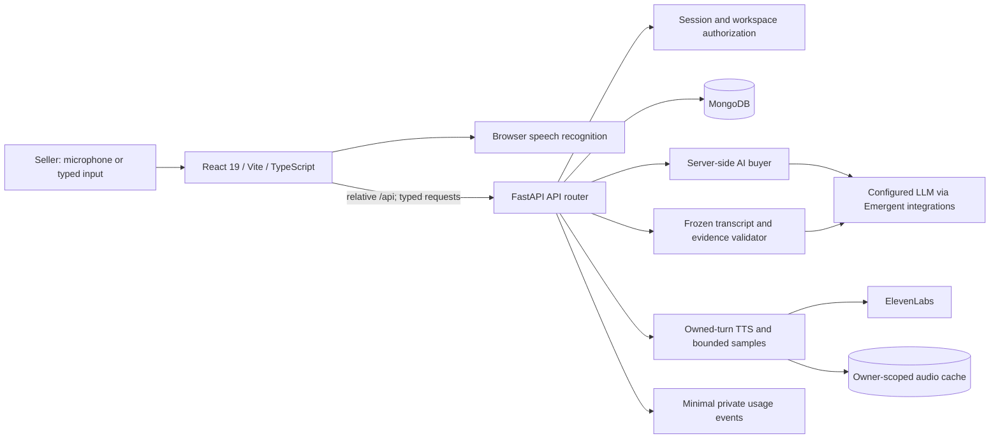

# RepForge architecture

## System boundary

The frontend runs on port 3000 in the inspected environment and proxies `/api` to
FastAPI on port 8001. Secrets stay on the backend. `src/lib/api.ts` centralises typed
JSON/audio requests, credentials, timeouts and cancellation; TanStack Query manages
read/mutation state and invalidation. Pydantic models and handwritten TypeScript
interfaces are updated together; TypeScript alone does not validate network JSON.

## Authentication and workspace privacy

Managed Google sign-in is an additional entry point, not a replacement session stack.
The current browser origin determines its dashboard callback. A 10-minute state plus
tab-held verifier protects initiation/callback matching; the backend exchanges the
temporary session ID with Emergent and never accepts browser-supplied identity claims.
The documented managed response omits `email_verified`, so existing matching password
accounts confirm their RepForge password once unless the trusted response explicitly
attests verification. Subsequent logins use the bound managed identity. New users get
isolated workspaces; no team/role inference uses Google email domains or display names.
Upstream session tokens are discarded; the existing app cookie/bearer/revocation scheme
is reused. Replay/expiry checks and unique bindings protect repeat callbacks. Embedded
previews can open RepForge in a new tab for Google's account picker. Actual Google consent
completion requires a human-owned Google session; synthetic test identities are not
claimed as a live Google login.

- Password accounts use bcrypt with a UTF-8 byte-length guard. Email is normalised;
  a unique database index arbitrates concurrent signup conflicts.
- An HttpOnly cookie is primary. A 12-hour bearer fallback remains for preview iframe
  cookie blocking, now in **tab-scoped sessionStorage**, not durable localStorage.
- The server verifies signature/expiry, existing account and its revocation epoch.
  A valid cookie is preferred over an expired bearer. Logout increments the epoch and
  clears the cookie. Account changes clear account-specific query state.
- Each personal/guest account has an isolated immutable workspace ID. Membership
  documents, not organisation labels or client-selected roles, establish authorization.
- Invitation possession plus the intended authenticated account email permits joining.
  Codes expire after 48 hours and are privately shared by the manager; no invitation
  email delivery is implemented. This is not a claim of independently verified email ownership.
- Team reports/assignment writes require manager/admin/owner membership. Platform
  administration is separate; owning a personal workspace does not grant global analytics.
- Same-origin and explicitly configured-origin checks protect mutations. Forwarded
  addresses are considered only at a configured trusted proxy boundary. Operators must
  also configure ingress, cookie and proxy trust correctly.

## Data model

| Collection | Role |
| --- | --- |
| `users` | Profile, password hash, session epoch, XP award markers, personal/active workspace |
| `workspaces`, `memberships`, `invitations` | Isolated tenants, verified access, bounded invitation codes |
| `simulations` | Owner, scenario/product snapshot, stable voice configuration, turns, lifecycle, frozen evidence, evaluation and retry links |
| `sales_profiles` / custom scenario collections | Seller-supplied business facts and generated fictional buyer situations |
| `assignments` | Workspace-scoped exercise/difficulty, authenticated assigner and exact completed session |
| `rate_limits`, `leases` | Shared counters and atomic expiring reservations across workers |
| `audio_cache`, `provider_checks` | Expiring audio and voice-provider check cache |
| `evidence_events`, `feedback` | Minimal usage events and optional post-coaching helpfulness ratings |

Personal transcripts remain owner-only; managers see summaries, not unrestricted
transcripts. Reports are not automatically anonymised for public sharing.

## Conversation lifecycle

`preparation → active → ending → grading → completed`

`grading → grading_failed → grading` is recoverable without reopening speech.
Preparation/active sessions can be abandoned. Activation anchors the clock on the
server; elapsed session time is not claimed as measured speech duration.

Salesperson turns have stable IDs, idempotency keys and version checks. Acceptance is
persisted before the provider call. A failure does not pop or erase another request's
turn. End Call atomically freezes the authoritative transcript/version. Late prospect
replies cannot enter it. A grading lease and recovery sweep allow interrupted workers
to leave a recoverable state. Evaluation/reward completion uses an outbox-style pending
marker plus atomic per-user award IDs; retries do not award XP twice.

Client recognition instances and audio generations have lifecycle identities. Superseded
callbacks cannot restart a newer recognizer or clean up newer playback. Pending requests
are aborted and object URLs/handlers released on stop/navigation. Finalised fragments
arriving while a reply is pending are retained as a visible draft. Browser/device edge
cases still require manual verification; this is turn-based voice interaction, not a
certified full-duplex telephony engine. Only End Call disconnects the software session.

## AI buyer and scoring

The buyer gets the selected difficulty/personality, hidden fictional prospect context,
seller-supplied product facts and permitted prior conversation context. Prompts treat
transcripts/profiles as data, not authorization or rubric instructions. This reduces
prompt-injection risk but is not a proof of complete resistance to adversarial prompts.

New grading uses `consultative-evidence-v2`, with exercise focus skills weighted 2 and
other applicable skills 1; moment rubrics target one skill. The validator requires real
JSON booleans/numbers, supported categories/tags/recommendations, valid turn indices and
exact quotations. Only assessed categories enter the weighted overall score; absent
skills are unassessed, not failed. Legacy reports stay readable and are labelled unvalidated.
The rubric/model and transcript version accompany the evaluation.

There is at most one validation-repair attempt under the same bounded grading deadline.
Validation is never relaxed; another invalid result becomes recoverable grading failure.
Retries do not commit partial evaluations or fabricated zero scores.

Word counts/share, response length and explicitly defined lexical patterns are computed
in code. Question heuristics depend on transcribed punctuation. Objections and buying
signals are AI interpretations. **No measured interruptions, speaking-time ratios,
vocal hesitation, acoustic confidence or raw-microphone replay is implemented.**

Full retries retain an explicit source and clone the scenario, difficulty, product/context,
rubric and voice. Their coached comparison is labelled separately from unaided progress.
Moment retries anchor exact turns, reconstruct surrounding context and grade a targeted
baseline using the same rubric/model. Ties are not improvement. Drills are not normal
buyer-journey history or full-call assessment trends.

## ElevenLabs and paid-resource controls

The existing ElevenLabs model/voices were retained; no generic browser-voice replacement
is silently substituted. Stable character IDs and versioned voice snapshots preserve
custom buyer identity even when a catalog voice is used.

`/api/voice/speak` requires an owned session and a saved prospect turn. Microphone checks
use fixed bounded samples; voice QA requires platform-admin access. Audio caching keys
include owner, text, model, voice and delivery settings. The cache contains generated
prospect audio, not recordings of the seller. Configuration, provider reachability and
playback success are different states. Human confirmation of hearing the sample is separate.

Mongo-backed expiring budgets cover guests, users, starts/retries and provider requests/
characters. A lease prevents simultaneous starts from bypassing the three-open-session
limit. These are conservative **reservation limits**, not exact provider spend accounting;
aborted upstream work may still be billable. Provider dashboard spend alerts remain advisable.

## Usage evidence and reporting

Server-authored events cover demo starts, first replies, grading and retry milestones.
They exclude raw transcripts, credentials, names and emails; actor identifiers are
pseudonymous, not a promise of irreversible anonymisation. Known fixtures/internal tests
are excluded. Return use uses distinct UTC days; demo completion uses a matched start cohort.
No old records are backfilled as customer adoption. Manager time savings are explicitly
adjustable estimates for qualifying full calls, never measured business impact.

History is paginated. Dashboard totals no longer silently stop at 500 records. Team
queries fetch member sessions together rather than sequentially per member; trends use
dated common cohorts. Very large histories still merit further aggregation/load testing.